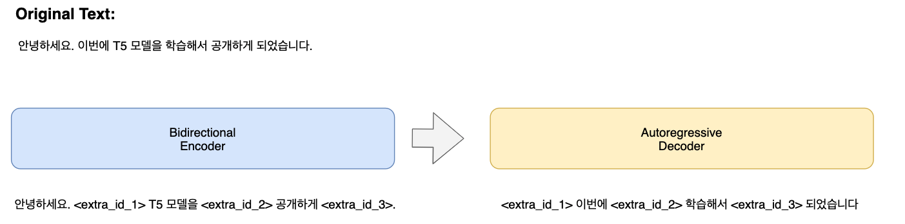

# kolang-t5-base(한국어 T5 모델)

<table><tr><td>
    <center></center>
</td></tr>
</table>

## Data
- 네이버 뉴스, 위키, 모두의 코퍼스 데이터를 활용하여서 총 `20GB` 데이터로 모델 학습을 진행하였습니다.

## Tokenizer
-  `Google Sentecepiece Tokenizer`를 사용하였습니다.
- `vocab size` 는 Token 35,000 과 T5에서 사용하는 Special Token 100개를 포함하여 총 `35,100` 입니다.

또한 `<unused0>` ~ `<unused99>`등의 미사용 토큰을 정의해 필요한 테스크에 따라 자유롭게 정의해 사용할 수 있게 했습니다.

```python
from transformers import T5Tokenizer
tokenizer = T5Tokenizer.from_pretrained('digit82/kolang-t5-base')

text = '안녕하세요. 한국어 T5 모델입니다.'

inputs = tok.encode(text)

tokenizer.tokenize(text)
['▁안녕', '하세요', '.', '▁한국어', '▁T', '5', '▁모델', '입니다', '.']
```

## Model
<table>
    <thead>
        <tr>
            <th>Model</th>
            <th># of params</th>
            <th>Type</th>
            <th># of layers</th>
            <th># of heads</th>
            <th>ffn_dim</th>
            <th>hidden_dim</th>
        </tr>
    </thead>
    <tbody>
        <tr>
            <td rowspan=2>T5-base</td>
            <td rowspan=2>225M</td>
            <td>Encoder</td>
            <td>12</td>
            <td>12</td>
            <td>3072</td>
            <td>768</td>
        </tr>
        <tr>
            <td>Decoder</td>
            <td>12</td>
            <td>12</td>
            <td>3072</td>
            <td>768</td>
        </tr>
    </tbody>
</table>

```python
import torch
import copy
from transformers import T5Model, T5Tokenizer, T5ForConditionalGeneration

tokenizer = T5Tokenizer.from_pretrained('digit82/kolang-t5-base')
t5_model = T5ForConditionalGeneration.from_pretrained('digit82/kolang-t5-base')

text = "자연어 처리 또는 자연 언어 처리는 인간의 언어 현상을 컴퓨터와 같은 기계를 이용해서 묘사할 수 있도록 연구하고 이를 구현하는 인공지능의 주요 분야 중 하나다.

inputs = tok.encode(text)
print(inputs)
[2378, 33545, 2703, 2173, 2378, 7103, 1271, 1296, 6381, 7103, 11642, 4873, 33588, 1330, 1014, 2013, 1442, 1792, 14772, 33594, 1012, 1605, 27156, 1566, 31231, 3642, 33512, 1718, 1812, 1032, 10677, 33508, 3]

## 임의의 Token에 대한 Masking 처리
mask_position = [3, 10, 17, 23, 30]

inputs_mask = copy.deepcopy(inputs)

replace_idx = 35098
replace_cnt = 0
for i in selected_idx:
    inputs_mask[i] = replace_idx - replace_cnt
    replace_cnt = replace_cnt + 1

tokenizer.decode(inputs)
'자연어 처리 또는 자연 언어 처리는 인간의 언어 현상을 컴퓨터와 같은 기계를 이용해서 묘사할 수 있도록 연구하고 이를 구현하는 인공지능의 주요 분야 중 하나다.</s>'

tokenizer.decode(input_mask)
'자연어 처리<extra_id_1> 자연 언어 처리는 인간의 언어<extra_id_2> 컴퓨터와 같은 기계를 이용<extra_id_3> 묘사할 수 있도록 연구하고<extra_id_4> 구현하는 인공지능의 주요 분야 중<extra_id_5>.</s>'

out = t5_model.generate(torch.tensor([inputs_mask]))

tok.decode(out.tolist()[0])
'<pad> <extra_id_1> 등<extra_id_2> 대신<extra_id_3> 쉽게<extra_id_4> 이를<extra_id_5> 하나로'

```

## Performance

### NSMC
| [NSMC](https://github.com/e9t/nsmc)(acc)  |
|---|
|88.8|

### 복수개의 Subtask를 하나의 모델로 학습
- 5개의 subtask를 하나의 모델로 학습을 진행
    - NSMC
    - KorNLI
    - Question Pair
    - NIKL CoLA
    - NIKL Parapharase

- Finetuning Code
    - TBD

- Performance (Acc)

|NSMC|KorNLI|Question Pair|NIKL CoLA|NIKL Parapharase|
|---|---|---|---|---|
|88.0|77.1|93.3|52.5|55.4|

## Citation
```
@misc{shjung2021t5,
  author = {Jung, Seunghwan},
  title = {kolangT5Base: Pretrained T5 Model for Korean},
  year = {2021},
  publisher = {GitHub},
  journal = {GitHub repository},
  howpublished = {\url{https://github.com/seujung/kolang-t5-base}}
}
```

## Reference
- https://github.com/google-research/text-to-text-transfer-transformer
- https://github.com/huggingface/transformers
